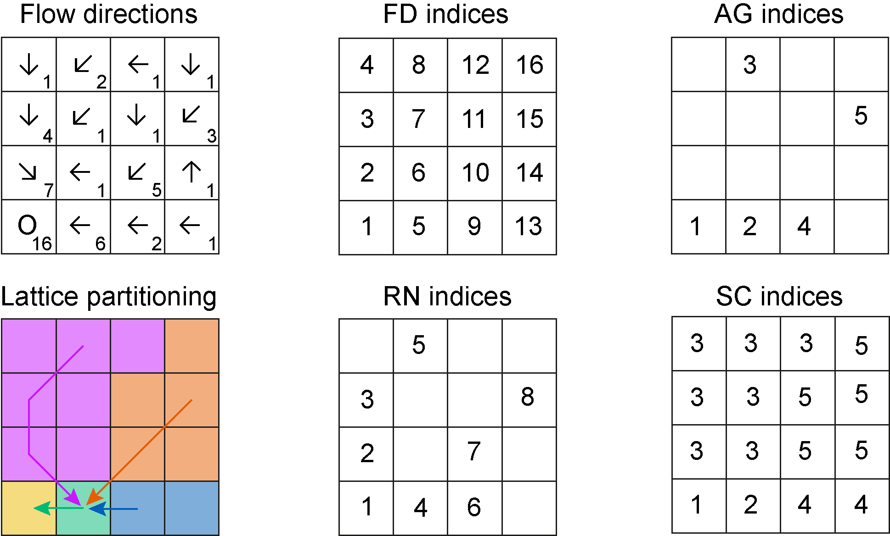

```{r setup, include = FALSE}
knitr::opts_chunk$set(
  collapse = TRUE,
  comment = "#>"
)
``` 

```{r lib, echo = FALSE}
suppressPackageStartupMessages(library(OCNet))
suppressPackageStartupMessages(library(spam))
suppressPackageStartupMessages(library(igraph))
suppressPackageStartupMessages(library(SSN))
```

**Graphical abstract**
```{r, fig.width=7, fig.height=2}
set.seed(1)
OCN <- create_OCN(30, 20, outletPos = 1)
OCN <- aggregate_OCN(landscape_OCN(OCN), thrA = 3)
par(mfrow = c(1, 3), mai = c(0, 0, 0.2, 0.2))
draw_simple_OCN(OCN, thrADraw = 3)
title("Optimal Channel Network")
draw_elev3D_OCN(OCN, drawRiver = FALSE, addColorbar = FALSE, expand = 0.2, theta = -30)
title("Elevation")
draw_thematic_OCN(OCN$AG$streamOrder, OCN, discreteLevels = TRUE, colPalette = rainbow(4))
title("Strahler stream order")

```

# Overview

OCNet enables the creation and analysis of Optimal Channel Networks (OCNs). These are oriented spanning trees (built on rectangular lattices made up of square pixels) that reproduce all scaling features characteristic of real, natural river networks [@rodriguez1992; @rinaldo2014]. As such, they can be used in a variety of numerical and laboratory experiments in the fields of hydrology, ecology and epidemiology. Notable examples include studies on metapopulations and metacommunities [e.g. @carrara2012], scenarios of waterborne pathogen invasions [e.g. @gatto2013] and biogeochemichal processes in streams [e.g. @helton2018].

OCNs are obtained by minimization of a functional which represents total energy dissipated by water flowing through the network spanning the lattice. Such a formulation embeds the evidence that morphological and hydrological characteristics of rivers (in particular, water discharge and slope) follow a power-law scaling with drainage area. For details on the theoretical foundation of the OCN concept, as well as for examples of their use, see @rinaldo2014.^[A manuscript presenting the package is in preparation for Methods in Ecology and Evolution]

***

# Some useful definitions

In graph theory, an oriented spanning tree is a subgraph of a graph $G$ such that:

- it is *oriented*: edges' directions are assigned and none of its pairs of nodes is linked by two symmetric edges;
- it is *spanning*: it contains all nodes of $G$;
- it is a *tree*: it is weakly connected (there exists a path between any pair of nodes, if edges' directions are neglected) and acyclic (no loops are present).

At the simplest aggregation level (flow direction - FD; see Section \@ref(sec:agg) below), OCNs are oriented spanning trees whose nodes are the pixels consituting the lattice and whose edges represent flow directions.

Moreover, OCNs, just like real rivers, are constituted of nodes whose *indegree* (i.e. the number of edges pointing towards a node) can assume any value while the *outdegree* (number of edges exiting from the node) is equal to 1, except for the *root* (or *outlet* node), whose outdegree is equal to 0. Nodes with null indegree are termed *sources*. Nodes with indegree larger than 1 are *confluences*. 

OCNet also allows building multiple networks within a single lattice. Each of these networks is defined by its respective outlet, which represents the root of a subgraph; the union of all subgraphs contains all elements of $G$. For simplicity, we will still refer to "OCNs" with regards to these multiple-outlet entities. In this case, strictly speaking, OCNs are not trees but rather *forests*. 

An OCN is defined by an *adjacency matrix* $\mathbf{W}$ with entries $w_{ij}$ equal to 1 if node $i$ drains into $j$ and null otherwise. Owing to the previously described properties, all rows of $\mathbf{W}$ have a single non-zero entry, except those identifying the outlet nodes, whose entries are all null. Each adjacency matrix uniquely defines a vector of *contributing areas* (or *drainage areas*) $\mathbf{A}$, whose components $A_i$ are equal to the number of nodes upstream of node $i$ plus the node itself. Mathematically, this can be expressed as $(\mathbf{I}-\mathbf{W}^T)\mathbf{A}=\mathbf{1}$, where $\mathbf{I}$ is the identity matrix and $\mathbf{1}$ a vector of ones.

***

# OCNet functions dependency tree

The generation of an OCN is performed by function `create_OCN`. Its only required inputs are the dimensions of the rectangular lattice, but several other features can be implemented via its optional inputs (see the function documentation for details). The output of `create_OCN` is a list, which can be used as input to the subsequent function `landscape_OCN`, as shown by the dependency tree below (indentation of an item implies dependency on the function at the above level).   

* `create_OCN`: performs the OCN search algorithm
  + `landscape_OCN`: calculates the elevation field generated by the OCN
      + `aggregate_OCN`: aggregates the OCN at various levels
          + `draw_thematic_OCN`: draws OCN with colors of nodes depending on a theme
          + `draw_subcatchments_OCN`: draws partition of the lattice into subcatchments as a result of the aggregation process of the OCN
          + `paths_OCN`: calculates paths and path lengths among OCN nodes
          + `rivergeometry_OCN`: evaluates hydraulic properties of the OCN
          + `OCN_to_igraph`: transforms the OCN into an igraph object
          + `OCN_to_SSN`: transforms the OCN into a SpatialStreamNetwork object
      + `draw_contour_OCN`: draws "real-shaped"^[If the OCN was generated with option `periodicBoundaries = FALSE`, the real-shaped representation of the OCN is equal to the simple, within-lattice representation provided by `draw_simple_OCN`. If the OCN was generated with `periodicBoundaries = TRUE`, its real-shaped representation is such that, starting from the outlet(s), the position of a FD node `i` is flipped with respect to a lattice side if the edge between `i` and the pixel downstream of `i` crosses such lattice side.] OCNs and catchment contours
      + `draw_elev2D_OCN`: draws 2D elevation field
      + `draw_elev3D_OCN`: draws 3D elevation field
       + `draw_elev3Drgl_OCN`: draws 3D elevation field (via `rgl` rendering system)
      + `find_area_threshold_OCN`: finds relationship between threshold area and number of nodes at the RN and AG level (see Figure \@ref(fig:ex-net) for relevant definitions)
  + `draw_simple_OCN`: fast drawing of OCNs
* `create_peano`: creates Peano networks

OCNet functions are intended to be applied in sequential order: for each non-drawing function, the input list is copied into the output list, to which new sublists and objects are added.

***

# Aggregation levels {#sec:agg}

Adjacency matrices and contributing area vectors of an OCN can be defined at different aggregation levels. In the output of OCNet functions, variables characterizing the OCN at the different aggregation levels are grouped within separate sublists, each of them identified by a two-letter acronym (marked in bold in the list below). Figure \@ref(fig:ex-net) provides a graphical visualization of the correspondence among the main aggregation levels.

0. *Nearest neighbours* (**N4**, **N8**). Every pixel of the lattice constitutes a node of the network. Each node is connected to its four (pixels that share an edge) or eight (pixels that share an edge or a vertex) nearest neighbours. At this level, $\mathbf{W}$ is defined but $\mathbf{A}$ is not. Note that this level does not describe flow connectivity, but rather proximity among pixels. Hence, $\mathbf{W}$ does not describe an oriented spanning tree.
1. *Flow direction* (**FD**). At this level, every pixel of the lattice is a node, but connectivity follows the flow directions that have been found by the OCN search algorithm (operated by function `create_OCN`). Edges' lengths are equal to either `cellsize` (the size of a pixel side, optional input in `create_OCN`) or `cellsize*sqrt(2)`, depending on whether flow direction is horizontal/vertical or diagonal.
2. *River network* (**RN**). The set of nodes at this level is a subset of the nodes at the FD level, such that their contributing area is larger than a certain threshold (optional input `A_thr` in `aggregate_OCN`). Such a procedure is customary in the hydrological problem of extracting a river network based on digital elevation models of the terrain [@ocallaghan1984], and corresponds to the geomorphological concept of erosion threshold [associated to a threshold in landscape-forming runoff, of which drainage area represents a proxy @rodriguez2001]. Edges' lengths are again equal to either `cellsize` or `cellsize*sqrt(2)`.
3. *Aggregated* (or *reach* - **AG**). The set of nodes at this level is a subset of the nodes at the RN level (see details in the next section). Accordingly, vector $\mathbf{A}$ is a subset of the vector of the same name defined at the RN level. Edges can span several pixels and therefore have various lengths.    
4. *Subcatchment* (**SC**). The number of nodes at this level is generally^[This might not be the case when there are many outlets. If the area drained by one of these outlets is lower than the threshold imposed, the cluster of pixels drained by that outlet constitutes a node at the SC level that does not have a correspondence at the AG level.] equal to that at the AG level. Each node is constituted by the cluster of pixels that directly drain into the edge departing from the corresponding node at the AG level. Here $\mathbf{W}$ does not represent flow connectivity but rather identifies terrestrial borders among subcatchments and is therefore symmetric. 
5. *Catchment* (**CM**). In this level, the number of nodes is equal to the number of outlets. Every node represents the portion of the lattice drained by its relative outlet. $\mathbf{A}$ stores drainage area values for each of these catchments, while $\mathbf{W}$ identifies terrestrial borders among catchments. 

```{r ex-net, echo=FALSE, fig.cap="Representation of the different aggregation levels at which the network is defined (excluding the null levels N4 and N8). The example is obtained from a single-outlet 8x8 lattice. Letter 'O' identifies the outlet pixel. Arrows on the other pixels identify flow directions. Numbers represent the cumulative drainage area (in number of pixels). At the FD level, all 64 pixels belong to the network^[Note that this pattern of flow directions was not derived by an OCN search algortihm, but rather drawn manually for illustration purposes.]. To obtain the RN level, a threshold value of 5 on drainage area is applied to distinguish pixels belonging to the river network. The network at the AG level consists of 9 nodes. The SC level is obtained by splitting the lattice into portions whose pixels drain into the AG nodes and edges. In this example, because there is only one outlet, all pixels belong to a single node at the CM level.", out.width = '70%'}
knitr::include_graphics("example_networks.png")
```

## Relationship between nodes at the RN and AG levels
<!-- 8 of them correspond to the pixels that represent the channel heads, namely the nodes at RN level with either null indegree (sources) or indegree $> 1$ (confluences), the ninth represents the outlet node (black circle in the bottom-left panel). All nodes except the outlet node have edges departing from them. -->
Nodes at the AG level correspond to a subset of nodes at the RN level. In particular, nodes at the AG level belong to at least one of these four categories:

* *Sources*: nodes at the RN level with null indegree.
* *Confluences*: nodes at the RN level with indegree larger than one.
* *Outlets*: corresponding to outlets at the RN level.
* *Breaking nodes* (only if `maxReachLength` is finite): nodes that split edges that are longer than `maxReachLength`.

Outlet nodes at the AG level might also be sources, confluences or breaking nodes. All AG nodes except outlet nodes have outdegree equal to 1. All RN nodes that do not correspond to AG nodes constitute the edges of the network at the AG level: more specifically, each edge is formed by an AG node and a sequence of RN nodes downstream of the AG node, until another AG node is found.

Figure \@ref(fig:ex3-net) shows an alternative aggregation scheme for the network showed in Figure \@ref(fig:ex-net) when the optional input `maxReachLength` is set to a finite value.

```{r ex3-net, echo=FALSE, fig.cap="Aggregation of the previous network with `A_thr` equal to 5 pixels and `maxReachLength` equal to 3 pixel sides. Note that the length of the diagonal segments of the edges is equal to `sqrt(2)`.", out.width = '70%'}
knitr::include_graphics("example_networks3.png")
```

## Correspondence between indices at different levels

The output of `aggregate_OCN` contains objects named `OCN$XX$toYY`, where `XX` and `YY` are two different aggregation levels. These objects define the correspondences between indices among aggregation levels. `OCN$XX$toYY` contains a number of elements equal to the number of nodes at `XX` level; each element `OCN$XX$toYY[[i]]` contains the index/indices at `YY` level corresponding to node `i` at `XX` level. For aggregation level AG, additional correspondence objects are marked by the string `Reach`: these consider the whole sequence of RN nodes constituting the edge departing from an AG node as belonging to the AG node.

The example shown in Figure \@ref(fig:ex-ind) corresponds to the dataset `OCN_4` included in the package. Note that index numbering starts from the lower-left (southwestern) corner of the lattice.

```{r ex-ind, echo=FALSE, fig.cap="Top-left panel: arrows display flow directions, numbers identify contributing areas. Bottom-left panel: the network is aggregated by imposing a threshold equal to 2 pixels. The other panels display indices of nodes at the different aggregation levels. ", out.width = '90%'}

```

The R code below displays the different `OCN$XX$toYY` objects corresponding to the example in Figure \@ref(fig:ex-ind):

```{r}
ex <- aggregate_OCN(landscape_OCN(OCN_4), thrA = 2)

ex$FD$toRN
ex$FD$toSC

ex$RN$toFD
ex$RN$toAG
ex$RN$toAGReach

ex$AG$toFD
ex$AG$ReachToFD
ex$AG$toRN
ex$AG$ReachToRN

ex$SC$toFD

```

***

# A working example

Let's build an OCN on a 20x20 lattice and assume that each cell represents a square of side 500 m. The total size of the catchment is therefore 100 km^2^. Let's locate the outlet close to the southwestern corner of the lattice. Function `draw_simple_OCN` can then be used to display the OCN.

```{r, fig.width=4, fig.height=4}
set.seed(1)
OCNwe <- create_OCN(20, 20, outletPos = 3, cellsize = 500)
par(mai=c(0,0,0,0))
draw_simple_OCN(OCNwe)

```

Now, let's construct the elevation field subsumed by the OCN. Let's suppose that the outlet has null elevation and slope equal to 0.01. Then, we use `draw_elev3D_OCN` to draw the three-dimensional elevation map (values are in m). 

```{r, fig.width=7, fig.height=2.8}
OCNwe <- landscape_OCN(OCNwe, slope0 = 0.01)
par(mai=c(0,0,0,0.5))
draw_elev3D_OCN(OCNwe, drawRiver = FALSE)

```

Next, the OCN can be aggregated. Let's suppose that the desired number of nodes at the AG level be as close as possible^[It is not guaranteed that an OCN can be aggregated to an arbitrary number of nodes. This is due to the fact that the indegree of confluence nodes is typically 2 or 3, depending on the flow direction patterns. For example, if the outlet is not a confluence node, all confluence nodes have indegree equal to 2, and `maxReachLength = Inf`, then the resulting number of aggregated nodes will be even.] to 20. With function `find_area_threshold_OCN` we can derive the corresponding value of drainage area threshold:

```{r}
thr <- find_area_threshold_OCN(OCNwe)
# find index corresponding to thr$Nnodes ~= 20
indThr <- which(abs(thr$nNodesAG - 20) == min(abs(thr$nNodesAG - 20)))
indThr <- max(indThr) # pick the last ind_thr that satisfies the condition above
thrA20 <- thr$thrValues[indThr] # corresponding threshold area
```

The resulting number of nodes is^[The number of aggregated nodes is here uneven because one node has indegree equal to 3 (see figure below).] `r thr$nNodesAG[indThr]`, corresponding to a threshold area `thrA20 = ` `r thrA20/1e6` km^2^. The latter value can now be used in function `aggregate_OCN` to obtain the aggregated network. Function `draw_subcatchments_OCN` shows how the lattice is partitioned into subcatchments. It is possible to add points at the locations of the nodes at the AG level. 
```{r, fig.width=7, fig.height=2.8}
OCNwe <- aggregate_OCN(OCNwe, thrA = thrA20)
par(mai=c(0.1,0,0.1,0))
draw_subcatchments_OCN(OCNwe)
points(OCNwe$AG$X,OCNwe$AG$Y, pch = 21, col = "blue", bg = "blue")

```

Finally, `draw_thematic_OCN` can be used to display the along-stream distances of RN-level nodes to the outlet (in m), as calculated by `paths_OCN`.

```{r, fig.width=7, fig.height=2.8}
OCNwe <- paths_OCN(OCNwe, pathsRN = TRUE)
par(mai=c(0.1,0,0.1,0))
draw_thematic_OCN(OCNwe$RN$downstreamPathLength[ , OCNwe$RN$outlet], OCNwe, 
                  backgroundColor = "#606060")

```

## Application: metapopulation model

### Theory

Let's build a simple discrete-time, deterministic metapopulation model on the previously built OCN. In particular, let's assume that:

* The expected population growth at node $i$ follows the Beverton-Holt model, with proliferation rate $r$ and carrying capacity $K_i$.
* At each timestep, the number of individuals moving from node $i$ is expressed as $G(P_i(t),K_i)$, where $P_i(t)$ is the (expected) population size at node $i$ and time $t$.
* $G(P_i(t),K_i)=G(K_i,K_i)\cdot P_i(t)/K_i$, namely the number of individuals moving from node $i$ increases linearly with $P_i(t)$.
* At each timestep, individuals at node $i$ can only move to a node that is directly connected to $i$, either downstream or upstream.
* $p_d$ and $p_u = 1 - p_d$ identify the probability to move downstream or upstream, respectively. For a headwater node $i$, due to the lack of an upstream connection, the actual (expected) number of individuals moving out of $i$  at time $t$ is $p_d G(P_i(t),K_i)$. Vice versa, the (expected) number of individuals moving out of the outlet $o$ at time $t$ is $p_u G(P_o(t),K_o)$. 
* If the indegree of a node is larger than one, individuals moving upstream are split among the possible destination nodes into fractions $Y$ proportional to their drainage areas.

Therefore, the model equation is:
$$
\begin{split}
P_i(t+1) &= \frac{r P_i(t)}{1+ (r-1)P_i(t)/K_i} - (p_d D_i + p_u U_i)G(K_i,K_i)\frac{P_i(t)}{K_i} \\
&\quad + p_d \left( \sum_{j=1} w_{ji} G(K_j,K_j)\frac{P_j(t)}{K_j}\right) + p_u \left( \sum_{j=1} w_{ij} Y_i G(K_j,K_j)\frac{P_j(t)}{K_j}\right)
\end{split}
$$
where $D_i$ ($U_i$) is equal to one if there is a downstream (upstream) connection available from node $i$ and is null otherwise. Weights $Y_i$ are defined as:
$$
Y_i = \frac{A_i}{\sum_{k=1} w_{kj}A_k},
$$
where $j$ identifies the node downstream of $i$. Moreover, it is $Y_o = 1$.

At carrying capacity, the system is at equilibrium, which implies that the (expected) number of individuals moving from a node $i$ to its downstream connection $j$ is equal to the (expected) number of individuals moving from $j$ to $i$:
$$
p_d G(K_i,K_i) = p_u Y_i G(K_j,K_j).
$$
The iterative application of the above equation allows the calculation of $G(K_i,K_i)$ for all $i$ up to a constant. To this end, let's assume $G(K_o,K_o) = G_o$. We therefore obtain
$$
G(K_i,K_i) = G_o \left(\frac{p_u}{p_d}\right)^{|P_{io}|} \prod_{k \in P_{io}} Y_k,
$$
where $P_{io}$ is the set of nodes constituting the downstream path from $i$ to the outlet $o$, while $|P_{io}|$ is its cardinality. 

### Implementation

For this example, let's use the previously derived `OCN_we` aggregated at the RN level. Let's assume that carrying capacity is proportional to the river width evaluated at the nodes, while the initial population distribution is randomly assigned. 

```{r}
## Input data
OCNwe <- rivergeometry_OCN(OCNwe, widthMax = 5)   # evaluate river width 
K <- 10*OCNwe$RN$width                             # calculate carrying capacity 
pop0 <- 2*mean(K)*runif(OCNwe$RN$nNodes)           # initial random population vector
nTimestep <- 100                                   # number of timesteps
r <- 1.05                                          # proliferation rate
pd <- 0.5                                          # probability to move downstream
pu <- 1 - pd                                       # probability to move upstream
Go <- 5                                            # parameter controlling mobility 
# (no. individuals exiting from outlet node at carrying capacity is pu*Go) 
```

We can now compute weights $Y$:
```{r}
## Weights for upstream movement
Y <- rep(1,OCNwe$RN$nNodes)                    
for (i in 1:OCNwe$RN$nNodes){
  if (i != OCNwe$RN$outlet){
    Y[i] <- OCNwe$RN$A[i]/(OCNwe$RN$W[ , OCNwe$RN$downNode[i]] %*% OCNwe$RN$A)
  }
}
```

and $G(K_i,K_i)$:
```{r}
## Evaluate expected number of individuals moving at carrying capacity
GKK <- rep(0, OCNwe$RN$nNodes)
for (i in (1:OCNwe$RN$nNodes)){
  path <- OCNwe$RN$downstreamPath[[i]][[OCNwe$RN$outlet]] # select path
  prod <- Go                                                # initialize product of Y 
  for (j in path){
    prod <- prod*Y[j]
  }
  GKK[i] <- (pu/pd)^(length(path))*prod  
}
```

We can now run the metapopulation model:
```{r}
## Run metapopulation model
pop <- matrix(data=0,ncol=nTimestep,nrow=OCNwe$RN$nNodes)  # metapopulation matrix
pop[,1] <- pop0                                              # initialization
for (t in 2:nTimestep){
  for (i in 1:OCNwe$RN$nNodes){
    pop[i, t] <- 
      # Beverton-Holt growth model
      r*pop[i, t-1]/(1 + pop[i, t-1]*(r-1)/K[i]) +
      # individuals exiting from node i
                - (pu*(sum(OCNwe$RN$W[ , i])>0) + pd*(sum(OCNwe$RN$W[i, ])>0)) * 
      GKK[i] * (pop[i,t-1]/K[i]) +
      # individuals entering in i from the upstream nodes
                + pd * OCNwe$RN$W[ , i] %*% (GKK*pop[ , t-1]/K) +
      # individuals entering in i from the downstream node
                + pu * Y[i] * OCNwe$RN$W[i, ] %*% (GKK*pop[ , t-1]/K) 
    
  }
}
```

The left panel of the graph below shows the time evolution of the local population at the outlet (red) and at the node at highest distance from the outlet (blue). In the right panel, the evolution total metapopulation size is shown. Dashed lines indicate population values at carrying capacity. 
```{r, fig.width=7, fig.height=2.8}
par(mfrow = c(1, 2))
plot(pop[OCNwe$RN$outlet, ], type = "l", ylim = c(0, 1.05*K[OCNwe$RN$outlet]), col = "red", 
     xlab = "Time", ylab = "Population", lwd = 2)
title("Evolution of local pop. size")
lines(c(1, nTimestep),c(K[OCNwe$RN$outlet], K[OCNwe$RN$outlet]), col = "red", lty = 2)
farthestNode <- which(OCNwe$RN$downstreamPathLength[ , OCNwe$RN$outlet]
                      == max(OCNwe$RN$downstreamPathLength[ , OCNwe$RN$outlet]))[1]
lines(pop[farthestNode, ], type="l", col="blue",lwd=2)
lines(c(1, nTimestep), c(K[farthestNode], K[farthestNode]), col = "blue", lty = 2)

plot(colSums(pop), type = "l", xlab = "Time", ylab = "Population", lwd = 2, ylim = c(0, 1.05*sum(K)))
lines(c(1, nTimestep), c(sum(K),sum(K)), lty = 2)
title("Evolution of metapop. size")
```


Function `draw_thematic_OCN` can be used to visualize the spatial distribution of the metapopulation at given time points.
```{r, fig.width=7, fig.height=5}
par(mfrow = c(2, 2), mai = c(0.1, 0, 0.2, 0))
draw_thematic_OCN(pop[,1], OCNwe, colLevels = c(0, max(K), 1000),
                  drawNodes = TRUE)
title("Time = 1")
draw_thematic_OCN(pop[,5], OCNwe, colLevels = c(0, max(K), 1000),
                  drawNodes = TRUE)
title("Time = 5")
draw_thematic_OCN(pop[,20], OCNwe, colLevels = c(0, max(K), 1000),
                  drawNodes = TRUE)
title("Time = 20")
draw_thematic_OCN(pop[,100], OCNwe, colLevels = c(0, max(K), 1000),
                  drawNodes = TRUE)
title("Time = 100")

```

***

# Peano networks

Function `create_peano` can be used in lieu of `create_OCN` to generate Peano networks on square lattices. Peano networks are deterministic, plane-filling fractals whose topological measures (Horton's bifurcation and length ratios) are akin to those of real river networks [@marani1991] and can then be used in a variety of synthetic experiments, as it is the case for OCNs [e.g. @campos2006]. Peano networks are generated by means of an iterative algorithm: at each iteration, the size of the lattice side is doubled (see code below). As a result, Peano networks span squares of side equal to a power of 2. The outlet must be located at a corner of the square.  

```{r, fig.width=7, fig.height=5}
par(mfrow = c(2, 3), mai = c(0, 0, 0.2, 0))
peano0 <- create_peano(0)
draw_simple_OCN(peano0)
title("Iteration: 0 - Lattice size: 2x2")

peano1 <- create_peano(1)
draw_simple_OCN(peano1)
title("Iteration: 1 - Lattice size: 4x4")

peano2 <- create_peano(2)
draw_simple_OCN(peano2)
title("Iteration: 2 - Lattice size: 8x8")

peano3 <- create_peano(3)
draw_simple_OCN(peano3)
title("Iteration: 3 - Lattice size: 16x16")

peano4 <- create_peano(4)
draw_simple_OCN(peano4)
title("Iteration: 4 - Lattice size: 32x32")

peano5 <- create_peano(5)
draw_simple_OCN(peano5)
title("Iteration: 5 - Lattice size: 64x64")

```

The output of `create_peano` is a list containing the same objects as those produced by `create_OCN`. As such, it can be used as input for all other complementary functions of the package.

```{r, fig.width=5, fig.height=3.5}
par(mai = c(0, 0, 0, 0))
peano5 <- landscape_OCN(peano5)
draw_elev2D_OCN(peano5)

```

***

# List of ready-made OCNs

OCNet contains some ready-made large OCNs built via function `create_OCN`. Their features are summarized in the Table below. Refer to the documentation of `create_OCN` for the definition of column names. Note that:

* If not specified otherwise, the position of outlet(s) was derived from default options. 
* **Cooling schedule**: 
  + *cold*: corresponds to `coolingRate = 10`, `initialNoCoolingPhase = 0`;
  + *default*: corresponds to default values `coolingRate = 1`, `initialNoCoolingPhase = 0`;
  + *hot*: corresponds to `coolingRate = 0.5`, `initialNoCoolingPhase = 0.1`.
* **seed** is the value of the argument used in the call of `set.seed` prior to executing `create_OCN`.
* **On CRAN?** identifies which OCNs are uploaded in the version of OCNet that can be downloaded from CRAN (owing to limitation in package size). Installation of package from [GitHub](https://github.com/lucarraro/OCNet) provides the complete set of OCNs hereafter described^[At this [GitHub link](https://github.com/lucarraro/OCNet-ExtendedData) it is possible to download the same OCNs generated by adding optional arguments `saveEnergy = TRUE`, `saveExitFlag = TRUE`, which substantially increases the size of the output of `create_OCN`.].


| name            | dimX | dimY | No. of outlets | Periodic Boundaries | Initial State | Cooling Schedule | Cellsize  | seed | On CRAN? |
| ----------:|:------:|:------:|:----------:|:-------------------:|:-------------:|:----------------:|:--------:|:----:|:-----:|
|`OCN_4`^[This is actually not an OCN, but was rather generated manually for illustration purposes.]     |   4    |   4    |    1       |      FALSE          |              |                   |  1       |     |      | Yes   |
|`OCN_20`             |   20   |   20   |    1       |      FALSE          |   I           |  default         |  1       |  1   | Yes   |
|`OCN_250`            |   250  |   250  |    1       |      FALSE          |   I           |  default         |  1       |  2   | No   |
|`OCN_250_T`          |   250  |   250  |    1       |      FALSE          |   T           |  default         |  1       |  2   | Yes    |
|`OCN_250_V`          |   250  |   250  |    1       |      FALSE          |   V           |  default         |  1       |  2   | No    |
|`OCN_250_cold`       |   250  |   250  |    1       |      FALSE          |   I           |  cold            |  1       |  2   | No    |
|`OCN_250_hot`        |   250  |   250  |    1       |      FALSE          |   I           |  hot             |  1       |  2   | No    |
|`OCN_250_V_cold`     |   250  |   250  |    1       |      FALSE          |   V           |  cold            |  1       |  2   | No    |
|`OCN_250_V_hot`      |   250  |   250  |    1       |      FALSE          |   V           |  hot             |  1       |  2   | No    |
|`OCN_250_PB`         |   250  |   250  |    1       |      TRUE           |   I           |  default         |  1       |  2   | Yes   |
|`OCN_rect1`          |   450  |   150  |    1       |      FALSE          |   I           |  default         |  1       |  3   | No    |
|`OCN_rect2`          |   150  |   450  |    1       |      FALSE          |   I           |  default         |  1       |  3   | No    |
|`OCN_300_diag`       |   300  |   300  |    1^[`OutletPos = 1`.]       |      FALSE          |   V           |  default         |  50      |  4   | No    |
|`OCN_300_4out`       |   300  |   300  |   4^[`OutletSide = c("S","N","W","E")`, `OutletPos = c(1,300,149,150)`.] | FALSE | V | default | 50 | 5 | Yes |
|`OCN_300_4out_PB_hot`|   300  |   300  |   4^[`OutletSide = c("S","N","W","E")`, `OutletPos = c(1,300,149,150)`.] | TRUE | V | hot | 50 | 5 | Yes |
|`OCN_300_7out`       |   300  |   300  |   7 | FALSE | V | default | 50 | 5 | No |
|`OCN_400_T_out`      |   400  |   400  |   1 | FALSE | T | hot | 50 | 7 | No |
|`OCN_400_Allout`     |   400  |   400  | All | FALSE | H | hot | 50 | 8 | Yes |
|`OCN_500_V_hot`      |   500  |   500  |   1 | FALSE | T | hot | 50 | 9 | No |
|`OCN_500_PB_hot`     |   500  |   500  |   1 | TRUE  | V | hot | 50 | 10 | No |

***

# Compatibility with other packages

## igraph

Adjacency matrices at all aggregation levels are produced as `spam` [@furrer2010] objects. In order to transform the OCN into an `igraph` [@csardi2006] graph object, the adjacency matrix must be converted into a `Matrix` object (via function `as.dgCMatrix.spam` of `spam`). Function `graph_from_adjacency_matrix` of `igraph` can then be used to obtain a graph object.

For example, let's transform the previously obtained `OCN_we` at the AG level into a graph:

```{r, fig.width=5, fig.height=4}
par(mai=c(0.1,0.1,0.1,0.1))
g <- OCN_to_igraph(OCNwe, level = "AG")
plot.igraph(g, vertex.color = rainbow(OCNwe$AG$nNodes), 
     layout = matrix(c(OCNwe$AG$X,OCNwe$AG$Y),ncol = 2, nrow = OCNwe$AG$nNodes))
```

The same network can be displayed as an OCN:

```{r, fig.width=5, fig.height=3}
par(mai=c(0,0,0,0))
draw_thematic_OCN(c(1:OCNwe$AG$nNodes), OCNwe, discreteLevels = TRUE, drawNodes = TRUE,
                  colPalette = rainbow,  cex = 3, riverColor = "#999999",
                  backgroundColor = "#00000000", addLegend = FALSE)
text(OCNwe$AG$X, OCNwe$AG$Y)

```

## SSN

Function `OCN_to_SSN` transforms an OCN at a given aggregation level into an SSN [@verhoef2014] object. See the following example: 

```{r, fig.width=7, fig.height=4}
ssnOCN <- OCN_to_SSN(OCNwe, level = "RN", obsDesign = SSN::binomialDesign(50),
                     path = paste(tempdir(), "/OCN.ssn", sep = ""), importToR = TRUE)
plot.SpatialStreamNetwork(ssnOCN, "upDist", breaktype = "user", brks = seq(0,14000,2000), 
                          xlab = "x [m]", ylab = "y [m]", asp = 1)
title("Distance from outlet of observation points [m]")

```


# References

---
references:
- id: ocallaghan1984
  title: The Extraction of the Drainage Networks from Digital Elevation Data
  author:
  - family: O'Callaghan
    given: J. F.
  - family: Mark
    given: D. A.
  container-title: Computer Vision, Graphics, and Image Processing
  volume: 28
  URL: 'http://dx.doi.org/10.1016/S0734-189X(84)80011-0'
  page: 323-344
  type: article-journal
  issued:
    year: 1984
    
- id: rinaldo2014
  title: Evolution and selection of river networks. Statics, dynamics, and complexity
  author:
  - family: Rinaldo
    given: A.
  - family: Rigon
    given: R. 
  - family: Banavar
    given : J. R.
  - family: Maritan
    given: A.
  - family: Rodriguez-Iturbe
    given: I. 
  container-title: Proceedings of the National Academy of Sciences of the United States of America
  volume: 111(7)
  URL: 'http://dx.doi.org/10.1073/pnas.1322700111'
  page: 2417-2424
  type: article-journal
  issued:
    year: 2014

- id: rodriguez2001
  title: Fractal river basins. Chance and self-organization
  author:
  - family: Rodriguez-Iturbe
    given: I.
  - family: Rinaldo
    given: A.
  publisher: Cambridge University Press
  type: book
  issued:
    year: 2001

- id: campos2006
  title: Transport on fractal river networks. Application to migration fronts
  author:
  - family: Campos
    given: D.
  - family: Fort
    given: J. 
  - family: Méndez
    given: V.
  container-title: Theoretical Population Biology
  volume: 69(1)
  URL: 'http://dx.doi.org/10.1016/j.tpb.2005.09.001'
  page: 88-93
  type: article-journal
  issued:
    year: 2006

- id: marani1991
  title: A note on fractal channel networks
  author:
  - family: Marani
    given: A.
  - family: Rigon
    given: R. 
  - family: Rinaldo
    given: A.
  container-title: Water Resources Research
  volume: 27(12)
  URL: 'http://dx.doi.org/10.1029/91WR02077'
  page: 3041-3049
  type: article-journal
  issued:
    year: 1991

- id: rodriguez1992
  title: Energy dissipation, runoff production, and the three‐dimensional structure of river basins
  author:
  - family: Rodriguez-Iturbe
    given: I.
  - family: Rinaldo
    given: A.
  - family: Rigon
    given: R.  
  - family: Bras
    given: R. L.
  - family: Marani
    given: A.  
  - family: Ijjász-Vásquez
    given: E.   
  container-title: Water Resources Research
  volume: 28(4)
  URL: 'http://dx.doi.org/10.1029/91WR03034'
  page: 1095-1103
  type: article-journal
  issued:
    year: 1992

- id: carrara2012
  title: Dendritic connectivity controls biodiversity patterns in experimental metacommunities
  author:
  - family: Carrara
    given: F.
  - family: Altermatt
    given: F.    
  - family: Rodriguez-Iturbe
    given: I.
  - family: Rinaldo
    given: A.
  container-title: Proceedings of the National Academy of Sciences of the United States of America
  volume: 109(15)
  URL: 'http://dx.doi.org/10.1073/pnas.1119651109'
  page: 5761-5766
  type: article-journal
  issued:
    year: 2012 
 
- id: gatto2013
  title: Spatially explicit conditions for waterborne pathogen invasion
  author:
  - family: Gatto
    given: M. 
  - family: Mari
    given: L.  
  - family: Bertuzzo
    given: E.
  - family: Casagrandi
    given: R.  
  - family: Righetto
    given: L.  
  - family: Rodriguez-Iturbe
    given: I.
  - family: Rinaldo
    given: A.
  container-title: American Naturalist
  volume: 182(3)
  URL: 'http://dx.doi.org/10.1086/671258'
  page: 328-346
  type: article-journal
  issued:
    year: 2013   
    
- id: helton2018
  title: How network structure can affect nitrogen removal by streams
  author:
  - family: Helton
    given: A.M. 
  - family: Hall
    given: R.O.  
  - family: Bertuzzo
    given: E.
  container-title: Freshwater biology
  volume: 63(1)
  URL: 'http://dx.doi.org/10.1111/fwb.12990'
  page: 128-140
  type: article-journal
  issued:
    year: 2018 

- id: furrer2010
  title: spam. A Sparse Matrix R Package with Emphasis on MCMC Methods for Gaussian Markov Random Fields
  author:
  - family: Furrer
    given: R. 
  - family: Sain
    given: S.R.  
  container-title: Journal of Statistical Software
  volume: 36(10)
  URL: 'http://dx.doi.org/10.18637/jss.v036.i10'
  page: 1-25
  type: article-journal
  issued:
    year: 2010 

- id: csardi2006
  title: The igraph software package for complex network research
  author:
  - family: Csardi
    given: G. 
  - family: Nepusz
    given: T.  
  container-title: InterJournal
  volume: Complex Systems
  URL: 'http://igraph.org'
  page: 1695
  type: article-journal
  issued:
    year: 2006 
    
- id: verhoef2014
  title: SSN. An R Package for Spatial Statistical Modeling on Stream Networks
  author:
  - family: Ver Hoef
    given: J.M. 
  - family: Peterson
    given: E.E.
  - family: Clifford
    given: D.
  - family: Shah
    given: R.  
  container-title: Journal of Statistical Software
  volume: 56(3)
  URL: 'http://dx.doi.org/10.18637/jss.v056.i03'
  page: 1–45
  type: article-journal
  issued:
    year: 2014     

---
